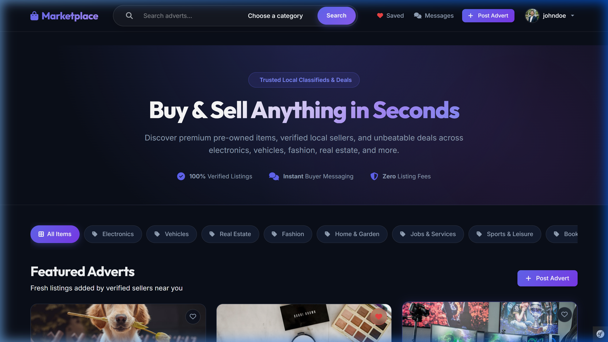
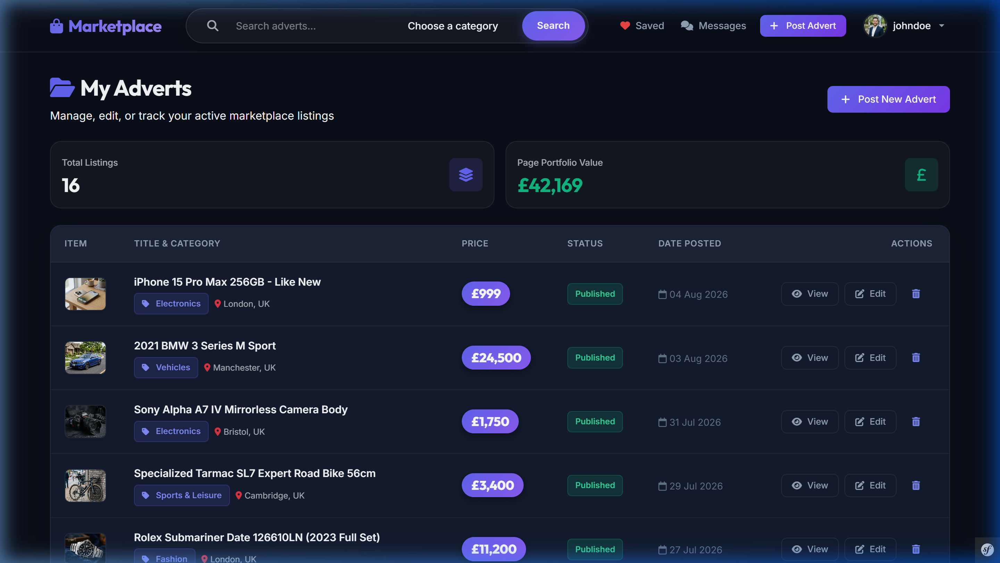
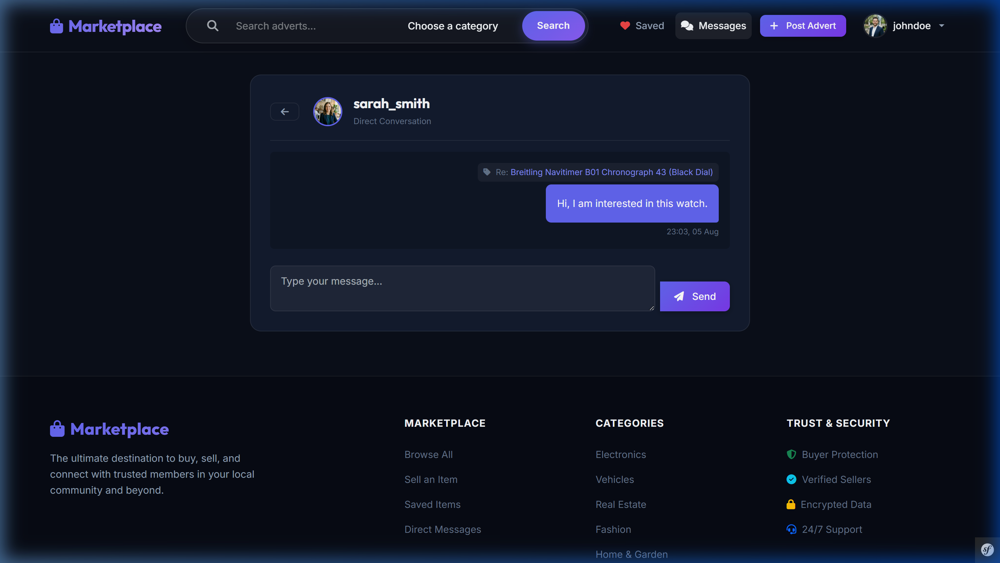

# 🛍️ Marketplace — Premium Classifieds Web Application

A modern, full-featured **Marketplace & Classifieds Web Application** built with **PHP 8.2+**, **Symfony 7**, **Doctrine ORM**, **Twig**, and **Bootstrap 5**. Designed with a sleek dark glassmorphism aesthetic, instant buyer-seller messaging, responsive grid layouts, category filtering, and robust security defenses.

---

## 📸 Screenshots & Showcase

### 1. Modern Dark Glassmorphic Homepage & Hero Section


### 2. Verified Advert Listings & Seller Dashboard


### 3. Direct Buyer-Seller Messaging Thread


---

## ✨ Core Features

- 🎨 **Modern Dark Glassmorphic UI**: Vibrant gradient accents, glassmorphic cards, and micro-interactions.
- 🚀 **Dynamic Category Quick Filter**: Instant category filtering with active state highlighting.
- 🔍 **Integrated Search Capsule**: Search by keyword, category, or location seamlessly across all viewports.
- 📱 **100% Fully Responsive Layout**: Tailored breakpoints for desktop, tablet, and mobile screens.
- 💬 **Direct Messaging System**: Instant buyer-seller chat threads linked to specific listings.
- ❤️ **Saved Adverts & Bookmarks**: User favorites management.
- 📊 **Seller Dashboard**: Real-time listing metrics, portfolio valuation, and quick action management (`View`, `Edit`, `Delete`).
- 🛡️ **Role-Based Access Control (RBAC)**: Fine-grained permissions for Users, Moderators, and Admins via EasyAdmin 4.
- 🖼️ **Automated WebP Image Optimization**: Image upload processing, thumbnail generation, and lazy loading.
- 📦 **Dummy Fixtures Included**: Pre-configured with realistic users, categories, and high-resolution item photography.

---

## 🔒 Security Architecture

- **SQL Injection Defense**: Strict prepared statement parameter binding (`addcslashes($title, '%_')` and Doctrine Query Builder parameterization).
- **XSS & Injection Protection**: HTML auto-escaping across all Twig templates and input sanitization.
- **HTTP Security Headers**: Automated listener injecting `X-Content-Type-Options: nosniff`, `X-Frame-Options: SAMEORIGIN`, `X-XSS-Protection`, `Referrer-Policy`, and `Permissions-Policy`.
- **Malicious Upload Defense**: MIME header verification (`getimagesize()`) restricting uploads strictly to JPEG, PNG, and WebP, re-encoding files via GD.
- **CSRF & Voter Authorization**: Token validation and Symfony Voters for ownership checks.

---

## ⚡ Performance Optimizations

- **N+1 Query Elimination**: Eager `leftJoin` and `addSelect` queries across repositories to fetch listings, users, and categories in single database calls.
- **Automatic WebP Conversion**: Proportional image resizing to 1200px max width and WebP encoding for fast page loading.
- **Browser Resource Efficiency**: Native `loading="lazy"` and `decoding="async"` applied across all media templates.
- **Even Pagination Grid**: 6 items per page ensuring clean 2-row alignment across 3-column layouts.

---

## 🛠️ Stack & Dependencies

- **PHP**: 8.2+
- **Framework**: Symfony 7
- **Database / ORM**: SQLite / Doctrine ORM
- **Templating**: Twig Engine
- **Admin Panel**: EasyAdmin 4
- **Pagination**: KnpPaginatorBundle
- **Frontend**: Vanilla CSS + Bootstrap 5 + FontAwesome 6

---

## 🚀 Quickstart & Installation

### 1. Clone Repository
```bash
git clone https://github.com/praiseOjay/Marketplace_website.git
cd Marketplace_website
```

### 2. Install PHP Dependencies
```bash
composer install
```

### 3. Setup Database & Load Fixtures
```bash
php bin/console doctrine:database:create --if-not-exists
php bin/console doctrine:schema:update --force
php bin/console doctrine:fixtures:load --no-interaction
```

### 4. Run Development Server
Using Symfony CLI or built-in PHP web server:
```bash
php -S 127.0.0.1:8000 -t public public/index.php
```
Open **[http://127.0.0.1:8000](http://127.0.0.1:8000)** in your browser.

---

## 👤 Test Demo Credentials

| Role | Username | Email | Password |
|---|---|---|---|
| **Admin** | `admin` | `admin@marketplace.com` | `admin123` |
| **User** | `johndoe` | `john@example.com` | `password123` |
| **User** | `sarah_smith` | `sarah@example.com` | `password123` |

---

## 📝 License

This project is licensed under the MIT License — see the [LICENSE](LICENSE) file for details.

---

## 📧 Contact

**Praise Ojerinola** — Ojerinolapraise@gmail.com  
GitHub: [praiseOjay](https://github.com/praiseOjay)  
Project Repository: [Marketplace_website](https://github.com/praiseOjay/Marketplace_website.git)
